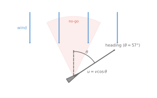
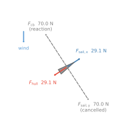

# Sailing Upwind

[](https://github.com/sdat2/sailing-upwind/actions/workflows/ci.yml)
[](https://sdat2.github.io/sailing-upwind)


This article derives, from basic physics, the angle that maximises upwind
progress of an idealized dinghy.

## Why sailing upwind is counterintuitive

Sailing *directly* into the wind is impossible: the forces push the boat
backwards.
For most dinghies, the region within about 45° of the wind is called the
**no-go zone** — the sail just flaps and generates no drive.

Yet if the destination is dead upwind the boat can still reach it by
**tacking** — zig-zagging on alternating close-hauled legs.
The question is how wide to make the zig-zags.

Sail too close to the wind ($\theta$ small) and the boat barely moves.
Bear away too far ($\theta$ large) and the boat is fast but pointing mostly
sideways — lots of distance covered, very little upwind progress.
Somewhere in between is an optimum.

---

## A note on the standard explanation

Most introductions invoke the **Bernoulli principle**: the curved sail forces
air faster over its outer face, lowering pressure and sucking it to windward.
This is usually illustrated with the "equal transit time" fallacy — two parcels
of air that conveniently rejoin at the trailing edge simultaneously, with no
physical justification.

The story is wrong. Sail aerodynamics is turbulent, high-Reynolds-number flow
where boundary layers separate at the leading edge.
"Lift equals low pressure" describes the outcome; it doesn't explain the mechanism.

This model uses only simple force diagrams — enough to derive the optimum angle approximately, requiring nothing beyond
a high school physics and maths (this model was my IB Maths coursework in 2014).

---

## The model

The sail acts as a momentum deflector (following [Wolfe 2002](https://newt.phys.unsw.edu.au/~jw/sailing.html), who presents the idea diagrammatically; the algebraic development below is independent).
In one second a column of air sweeps past the sail; the sail redirects and slows
it.
The net forward (propulsive) force is:

$$F_\text{sail} = \rho_a \, a_s \, v_s^2 \, |\sin\theta| \, (D_s - \cos\theta)$$

where $D_s$ is the **sail drag coefficient** — the fraction of wind speed
retained after passing over the sail, measured ≈ 0.895 on a Laser Pico with a
handheld anemometer.
This is the forward component only; the leeward push is cancelled by an
infinite lateral resistance from the centreboard and drops out.

The hull drag opposes forward motion:

$$F_\text{drag} = (1-D_h)\,\rho_w\,A_h\,v^2$$

Setting $F_\text{sail} = F_\text{drag}$ gives the terminal boat speed:

$$v(\theta) = \sqrt{\frac{\rho_a \, a_s \, v_s^2 \, |\sin\theta| \, (D_s - \cos\theta)}{(1-D_h)\,\rho_w\,A_h}}$$

The component of that speed actually going upwind is $u = v\cos\theta$.
Maximising $u$ over $\theta$ (see the [full derivation](#appendix-full-derivation)
below) reduces to solving a cubic in $x = \cos\theta$:

$$4x^3 - 3D_s\,x^2 - 3x + 2D_s = 0$$

**This cubic contains only $D_s$.**
The optimal angle depends solely on the sail drag coefficient — not on wind
speed, boat size, or hull shape.
For the Laser Pico ($D_s = 0.895$) the model predicts
$\theta_\text{opt} \approx \mathbf{56.8°}$, reassuringly close to the ~45–55°
taught in sailing school.

| $D_s$ | No-go threshold | Optimal angle |
|-------|-----------------|---------------|
| 0.60  | 53.1°           | 67.2°         |
| 0.895 | 26.5°           | 56.8°         |
| 0.95  | 18.2°           | 55.1°         |


*Boat speed and upwind component vs heading angle (Laser Pico, 4 m/s wind).
The dashed line marks the optimal angle; the dotted line the no-go threshold.*


*Upwind speed for five sail drag coefficients.
A lower $D_s$ (slipperier sail) pushes the optimal angle further from the wind.*

### Diagrams

  

*Left: top-down geometry at the optimal heading. Right: force diagram — propulsive
sail force (blue) balanced by hull drag (red); the leeward push and centreboard
reaction (grey, dashed) cancel and play no further role.*

---

## Python package

The full source is on [GitHub](https://github.com/sdat2/sailing-upwind).
All parameters live in [`config.yaml`](config.yaml).
Configuration is managed by [Hydra](https://hydra.cc) — any value can be overridden
on the command line without editing the file.

| Key | Meaning | Default |
|-----|---------|---------|
| `wind.speed_ms` | True wind speed (m/s) | 4.0 |
| `coefficients.D_s` | Sail drag coefficient | 0.895 |
| `coefficients.D_h` | Hull drag coefficient | 0.9 |
| `boat.sail_area_m2` | Sail area (m²) | 5.1 |
| `boat.hull_area_m2` | Frontal underwater area (m²) | 0.0343 |
| `model.mode` | `"one_deflector"` or `"two_deflector"` | `"one_deflector"` |
| `model.centreboard.area_m2` | Centreboard planform area (m²) | 0.125 |
| `model.centreboard.aspect_ratio` | Centreboard AR = span²/area | 6.0 |

```bash
pip install -e ".[dev]"

# Generate all plots and diagrams with default parameters
python -m sailing_upwind

# Override any parameter on the command line (Hydra syntax)
python -m sailing_upwind wind.speed_ms=7
python -m sailing_upwind model.mode=two_deflector
python -m sailing_upwind model.centreboard.area_m2=0.20 model.centreboard.aspect_ratio=8

pytest   # 34 tests, including doctests
```

**Repository layout**

```
config.yaml                    ← all tuneable parameters (Hydra config)
sailing_upwind/
  model.py                     ← core physics (boat_speed, upwind_speed, optimal_angle)
  two_deflector.py             ← two-deflector model with finite centreboard
  config.py                    ← YAML loader + validation
  plots.py                     ← matplotlib figures (one- and two-deflector)
  diagrams.py                  ← geometry and force diagrams (SVG)
  __main__.py                  ← CLI entry point (@hydra.main)
tests/
  test_model.py                ← unit tests + physics sanity checks
  test_config.py               ← config validation tests
two-def.md                     ← two-deflector model derivation and results
.github/workflows/ci.yml
.github/workflows/pages.yml
```

---

## Appendix: Full Derivation

### Variables and notation

| Symbol | Meaning | Units |
|--------|---------|-------|
| $\theta$ | angle between boat heading and wind | rad / ° |
| $v_s$ | true wind speed | m s⁻¹ |
| $v$ | boat speed | m s⁻¹ |
| $u$ | upwind component of boat speed | m s⁻¹ |
| $a_s$ | sail area | m² |
| $A_h$ | frontal underwater hull area | m² |
| $\rho_a$ | density of air | kg m⁻³ |
| $\rho_w$ | density of water | kg m⁻³ |
| $D_s$ | sail drag coefficient (fraction of wind speed retained after sail) | — |
| $D_h$ | hull drag coefficient (fraction of water speed retained after hull) | — |

### Assumptions

1. **Close-hauled geometry.** The sail lies along the boat's central axis, so the
   angle of attack of the wind on the sail equals the heading angle $\theta$.
2. **No aerodynamic hull drag.** Air resistance on the hull and crew is small
   compared with water drag and is ignored.
3. **Steady, uniform wind.** Wind speed $v_s$ is constant in time and uniform
   across the sail — no gusts, no wind gradient with height.
4. **Infinite lateral resistance (this model only).** The centreboard is assumed
   to prevent all sideways drift (leeway). Any leeward component of sail force is
   instantly cancelled by an equal centreboard reaction. Only the *forward*
   force balance matters. The [two-deflector model](two-def.md) removes this
   assumption.
5. **Flat, rigid sail.** The sail presents a flat surface; the aerodynamics are
   treated purely through Newton's laws (momentum conservation), not lift theory.
6. **Complete deflection.** The sail redirects all air that passes over it to the
   boat's axial direction — none escapes to the sides.
7. **Uniform speed reduction.** The sail slows the deflected air to a fraction
   $D_s$ of its original speed ($0 < D_s < 1$). $D_s = 1$ is a perfectly
   frictionless sail that changes direction without losing speed; $D_s = 0$
   brings the air to rest. Measured values for small dinghies cluster around
   $0.85$–$0.92$.
8. **Quadratic hull drag.** Drag $= (1-D_h)\,\rho_w\,A_h\,v^2$, i.e. the hull
   removes a fraction $(1-D_h)$ of the momentum of water passing its frontal
   area per second. This is the same momentum-flux model applied to water.

---

### Step 1 — How much air does the sail intercept?

Set up coordinates with the wind blowing in the $-y$ direction and the boat
heading at angle $\theta$ from the wind. The sail has area $a_s$ and lies along
the boat's axis.

The sail presents a **projected cross-section** $a_s|\sin\theta|$ perpendicular
to the wind. (At $\theta = 0°$ the boat faces directly into the wind and the
sail presents zero area; at $\theta = 90°$ the full sail area faces the wind.)

In one second a column of air of length $v_s$ sweeps past this cross-section.
Its volume is:

$$V = v_s \cdot a_s |\sin\theta|$$

Its **mass** is $m = \rho_a V = \rho_a a_s v_s |\sin\theta|$, so the
**momentum flux** (momentum delivered to the sail per second, i.e. force
available from the airstream) is:

$$\Upsilon = m \cdot v_s = \rho_a \, a_s \, v_s^2 \, |\sin\theta|$$

---

### Step 2 — Force from the sail: decomposing momentum change

The wind arrives travelling in the $-y$ direction (straight downwind) at speed $v_s$.
After hitting the sail the air is redirected to travel along the boat's *forward*
axis at the reduced speed $D_s v_s$.

To find the net forward force we compute the change in the air's momentum along the
boat's forward direction.

**Set up unit vectors.** Define forward as the $+x'$ direction (the boat's axis).
The boat heads at angle $\theta$ from the wind, so the forward unit vector in
world coordinates is $\hat{f} = (\sin\theta,\, \cos\theta)$.

**Incoming forward momentum flux.** The wind velocity in world coordinates is
$(0,\,-v_s)$. Its component along $\hat{f}$ is:

$$v_\text{in,fwd} = (0,-v_s)\cdot(\sin\theta,\cos\theta) = -v_s\cos\theta$$

The minus sign means the wind blows *against* the boat's heading when
$\theta < 90°$ — as expected when sailing upwind.

**Outgoing forward momentum flux.** After the sail deflects the air, it leaves
along the forward axis at speed $D_s v_s$:

$$v_\text{out,fwd} = +D_s v_s$$

**Change in forward velocity per unit mass of air:**

$$\Delta v_\text{fwd} = v_\text{out,fwd} - v_\text{in,fwd} = D_s v_s - (-v_s\cos\theta) = v_s(D_s + \cos\theta)$$

Multiplying by the mass flux $\dot{m} = \rho_a a_s v_s|\sin\theta|$ from Step 1,
Newton's second law gives the force that the sail exerts on the air. By Newton's
third law, the air exerts an equal and opposite force on the sail, driving the
boat forward:

$$F_\text{sail} = \dot{m}\,\Delta v_\text{fwd} = \rho_a a_s v_s^2|\sin\theta|(D_s + \cos\theta)$$

**The no-go zone.** This result implies positive drive for all $\theta \in (0°,90°)$,
which is wrong — every real boat refuses to sail close to the wind. The issue is that
the formula above assumed the exiting air always travels *forward* along the boat axis.
That is only geometrically possible if the sail can redirect air arriving nearly
head-on; for small angles the physical constraint is that the sail can only push air
*aft* of the beam.

The correct constraint is that the incoming airstream, which has a forward component
$-v_s\cos\theta$ (pointing aft), can only be redirected so that the *net* forward push
is positive. This is possible only if:

$$D_s v_s - v_s\cos\theta > 0 \quad \Longrightarrow \quad \cos\theta < D_s \quad \Longrightarrow \quad \theta > \arccos(D_s)$$

In this region the deflected air *does* exit with a forward component (it was pointing
aft, so the sail must do enough work to reverse that component *and* provide $D_s v_s$
forward). Replacing the earlier $+\cos\theta$ term with $-\cos\theta$ to reflect this
geometry:

$$\boxed{F_\text{sail} = \rho_a \, a_s \, v_s^2 \, |\sin\theta|\,(D_s - \cos\theta)}$$

This is positive only when $\theta > \arccos(D_s)$. For $D_s = 0.895$ the no-go
boundary is $\arccos(0.895) \approx 26.5°$, consistent with the $\sim45°$ empirical
no-go zone of real dinghies (the model understates the no-go zone because it ignores
stall and hull aerodynamics, which reduce effective $D_s$).

**What about the leeward component?**  
The incoming air also carries momentum *across* the boat. The transverse momentum
transferred to the boat per second is $\Upsilon\sin\theta$, pushing the boat leeward.
By assumption 4 the centreboard reacts with an equal and opposite force, so the
lateral equation is automatically satisfied and plays no further role.

---

### Step 3 — Hull drag

The hull moves through water at speed $v$. By the same momentum-flux argument as
step 1 (applied to water instead of air), the water drag force opposing forward
motion is:

$$F_\text{drag} = (1-D_h)\,\rho_w\,A_h\,v^2$$

Here $(1-D_h)$ is the fraction of the water's forward momentum that is removed
(i.e. transferred to the hull as drag) as the hull passes through. $D_h = 0.9$
means the hull is fairly streamlined — it only takes 10% of the momentum of the
water column it displaces.

---

### Step 4 — Terminal boat speed

At steady state the boat accelerates until the propulsive and drag forces balance.
Setting $F_\text{sail} = F_\text{drag}$:

$$\rho_a \, a_s \, v_s^2 \, |\sin\theta|(D_s - \cos\theta) = (1-D_h)\,\rho_w\,A_h\,v^2$$

Solving for $v$:

$$v^2 = \frac{\rho_a \, a_s \, v_s^2 \, |\sin\theta|(D_s - \cos\theta)}{(1-D_h)\,\rho_w\,A_h}$$

$$\boxed{v(\theta) = v_s\sqrt{\frac{\rho_a \, a_s \, |\sin\theta|(D_s - \cos\theta)}{(1-D_h)\,\rho_w\,A_h}}}$$

Notice that $v \propto v_s$ — the boat speed scales linearly with wind speed, as observed
in practice. All other factors are geometric or material constants.

**Dimensional check:**

$$[v] = \text{m\,s}^{-1} \cdot \sqrt{\frac{(\text{kg\,m}^{-3})(\text{m}^2)}{(\text{kg\,m}^{-3})(\text{m}^2)}} = \text{m\,s}^{-1}\cdot\sqrt{1} = \text{m\,s}^{-1} \checkmark$$

---

### Step 5 — Upwind velocity component

We want to maximise *upwind progress*, not raw speed. The component of boat
velocity directed straight into the wind is:

$$u(\theta) = v(\theta)\cos\theta$$

Substituting the expression for $v(\theta)$:

$$u(\theta) = v_s\cos\theta\sqrt{\frac{\rho_a a_s \sin\theta(D_s - \cos\theta)}{(1-D_h)\rho_w A_h}}$$

Since the square root is always positive and $v_s$ is a positive constant,
maximising $u$ is equivalent to maximising:

$$u^2(\theta) = \underbrace{\frac{\rho_a a_s v_s^2}{(1-D_h)\rho_w A_h}}_{\textstyle C\ (\text{const w.r.t.}\ \theta)} \cdot \underbrace{\cos^2\theta \cdot \sin\theta \cdot (D_s - \cos\theta)}_{\textstyle f(\theta)}$$

So we need to find $\theta$ that maximises $f(\theta) = \cos^2\theta\,\sin\theta\,(D_s - \cos\theta)$.

---

### Step 6 — Finding the optimal angle

**Substitution.** Let $x = \cos\theta$, so $\sin\theta = \sqrt{1-x^2}$ and
$\sin^2\theta = 1 - x^2$. We need $f'(\theta) = 0$.

It is easier to differentiate $f$ with respect to $\theta$ directly and
then substitute $x = \cos\theta$ afterward.

**Expand $f$:**

$$f(\theta) = \cos^2\theta\,\sin\theta\,D_s - \cos^3\theta\,\sin\theta$$

**Differentiate** using the product rule. Recall $\tfrac{d}{d\theta}(\cos\theta) = -\sin\theta$
and $\tfrac{d}{d\theta}(\sin\theta) = \cos\theta$:

$$\frac{df}{d\theta} = \frac{d}{d\theta}\!\left[D_s\cos^2\theta\sin\theta\right] - \frac{d}{d\theta}\!\left[\cos^3\theta\sin\theta\right]$$

For the first term, let $g = \cos^2\theta$ and $h = \sin\theta$:

$$\frac{d}{d\theta}[D_s g h] = D_s(g'h + gh') = D_s\!\left(-2\cos\theta\sin^2\theta + \cos^3\theta\right)$$

For the second term, let $g = \cos^3\theta$ and $h = \sin\theta$:

$$\frac{d}{d\theta}[gh] = g'h + gh' = -3\cos^2\theta\sin^2\theta + \cos^4\theta$$

Combining:

$$f'(\theta) = D_s\!\left(\cos^3\theta - 2\cos\theta\sin^2\theta\right) - \left(\cos^4\theta - 3\cos^2\theta\sin^2\theta\right) = 0$$

**Factor out $\cos\theta$** (we are looking for $0 < \theta < 90°$, so $\cos\theta > 0$
and this is valid):

$$D_s\!\left(\cos^2\theta - 2\sin^2\theta\right) - \cos\theta\!\left(\cos^2\theta - 3\sin^2\theta\right) = 0$$

**Substitute $x = \cos\theta$, $\sin^2\theta = 1 - x^2$:**

$$D_s\!\left(x^2 - 2(1-x^2)\right) - x\!\left(x^2 - 3(1-x^2)\right) = 0$$

$$D_s\!\left(3x^2 - 2\right) - x\!\left(4x^2 - 3\right) = 0$$

$$3D_s x^2 - 2D_s - 4x^3 + 3x = 0$$

Rearranging into standard form:

$$\boxed{4x^3 - 3D_s\,x^2 - 3x + 2D_s = 0 \qquad (x = \cos\theta_\text{opt})}$$

**Key insight:** this cubic contains *only* $D_s$. The optimal heading is **independent of wind
speed, boat size, sail area, and hull parameters** — it depends solely on how efficiently
the sail deflects air. This is a surprisingly clean result for what appears to be a
complicated optimisation.

**Selecting the physical root.** The cubic has three real roots when $D_s \in (0,1)$.
The physically meaningful root is the one satisfying:

- $0 < x < D_s$ (boat is heading outside the no-go zone, $\theta > \arccos(D_s)$, and $\theta < 90°$)
- $x = \cos\theta > 0$ (heading in the upwind half, $\theta < 90°$)

The other two roots correspond to mathematical solutions with no physical meaning
(e.g. $\theta > 90°$ or inside the no-go zone).

---

### Step 7 — Results for the Laser Pico

| Parameter | Symbol | Value |
|-----------|--------|-------|
| Wind speed | $v_s$ | 4 m/s (7.8 kn) |
| Sail area | $a_s$ | 5.1 m² |
| Hull frontal area | $A_h$ | 0.0343 m² |
| Sail drag coefficient | $D_s$ | 0.895 |
| Hull drag coefficient | $D_h$ | 0.9 |
| Air density | $\rho_a$ | 1.225 kg m⁻³ |
| Water density | $\rho_w$ | 1000 kg m⁻³ |

Substituting $D_s = 0.895$ into the cubic $4x^3 - 3(0.895)x^2 - 3x + 2(0.895) = 0$
and solving (e.g. with `numpy.roots`) gives three roots approximately:
$x \approx \{-0.831,\; 0.459,\; 0.547\}$.

The root $x \approx -0.831$ corresponds to $\theta \approx 146°$ (well past
beam-reach — not a useful upwind course). The root $x \approx 0.459$ gives
$\theta \approx 62.7°$, outside the range $0 < x < D_s$ physically (it is a
local minimum of $u$, not a maximum). The root $x \approx 0.547$ gives:

$$\theta_\text{opt} = \arccos(0.547) \approx 56.8°$$

Substituting back:

$$v_\text{opt} = 4\sqrt{\frac{1.225 \times 5.1 \times \sin(56.8°)\times(0.895 - \cos(56.8°))}{0.1 \times 1000 \times 0.0343}} \approx 2.86 \ \text{m/s}$$

$$u_\text{max} = v_\text{opt}\cos(56.8°) \approx 2.86 \times 0.547 \approx 1.60 \ \text{m/s} \approx 3.1 \ \text{knots}$$

## Bibliography

- T. W. Körner (1996). *The Pleasures of Counting*. Cambridge University Press.
  *(Inspiration for the dimensional-analysis approach.)*

- V. Radhakrishnan (1997). From Square Sails to Wing Sails: The Physics of Sailing Craft.
  *Current Science*, 73(6). *(Link no longer available.)*

- B. D. Anderson (2008). The Physics of Sailing. *Physics Today*.
  [Link](https://physicstoday.aip.org/features/the-physics-of-sailing)

- J. Wolfe (2002). The physics of sailing. University of New South Wales.
  [Link](https://newt.phys.unsw.edu.au/~jw/sailing.html)

