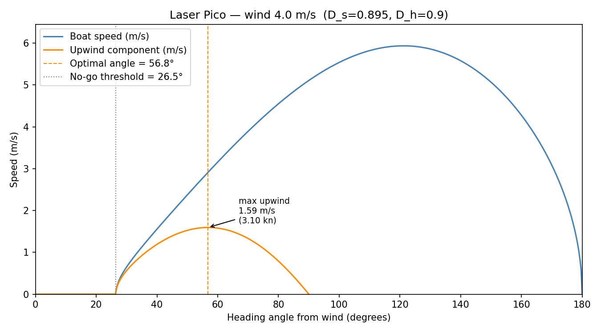
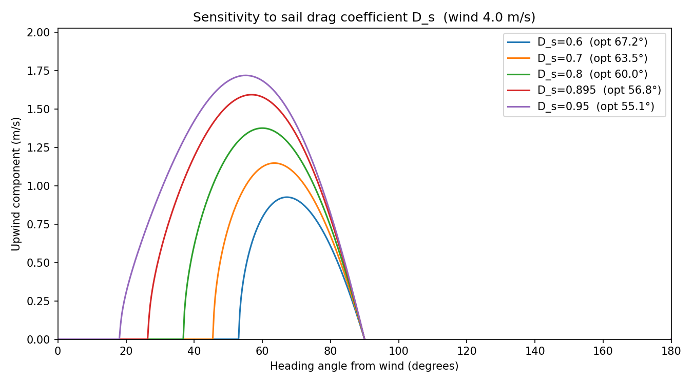

# Sailing Upwind

[](https://github.com/sdat2/sailing-upwind/actions/workflows/ci.yml)
[](https://sdat2.github.io/sailing-upwind)


This article derives, from basic physics, the angle that maximises upwind
progress — and shows that the answer can be pre-computed on shore.

## Why sailing upwind is counterintuitive

Sailing *directly* into the wind is impossible: the forces push the boat
backwards.
For most dinghies, the region within about 45° of the wind is called the
**no-go zone** — the sail just flaps and generates no drive.

Yet if the destination is dead upwind the boat can still reach it by
**tacking** — zig-zagging on alternating close-hauled legs, like a car
reversing into a tight parking space.
The question is how wide to make the zig-zags.

Sail too close to the wind ($\theta$ small) and the boat barely moves.
Bear away too far ($\theta$ large) and the boat is fast but pointing mostly
sideways — lots of distance covered, very little upwind progress.
Somewhere in between is an optimum.

---

## A note on the standard explanation

Most introductions to sail aerodynamics invoke the **Bernoulli principle**:
the sail is curved, air travelling over the longer outer face must cover more
distance and therefore moves faster, and by Bernoulli's equation faster air
means lower pressure, so the sail is sucked to windward.
This story is usually illustrated with a diagram of two parcels of air that
conveniently — and with no physical justification whatsoever — rejoin at the
trailing edge at the same moment (the "equal transit time" fallacy).

The equal-transit story is wrong even in a potential-flow idealisation, and
sail aerodynamics is emphatically *not* a potential-flow problem: the wind is
turbulent, the Reynolds numbers are large, and the boundary layers separate at
the leading edge in anything but the lightest of airs.
"Lift equals low pressure" is not false, but it is a *description of the
outcome*, not an explanation of the mechanism — it tells you nothing about
why the pressure difference exists, how large it will be, or how it changes
with angle.

The model here deliberately avoids all of that.
It uses nothing more than **Newton's three laws, a force diagram, and
trigonometry**.
The sail is treated as a simple momentum deflector: it changes the direction
and speed of the air flowing past it, and by Newton's third law the air
pushes back on the sail.
That is enough to derive the optimum angle to a remarkable degree of
precision, and every step of the argument can be checked by a student
who has finished a first course in mechanics.

---

## The model

The sail acts as a momentum deflector.
In one second a column of air sweeps past the sail; the sail redirects and slows
it.
The net forward (propulsive) force is:

$$F_\text{sail} = \rho_a \, a_s \, v_s^2 \, |\sin\theta| \, (D_s - \cos\theta)$$

where $D_s$ is the **sail drag coefficient** — the fraction of wind speed
retained after passing over the sail, measured ≈ 0.895 on a Laser Pico with a
handheld anemometer.

The hull drag opposes motion:

$$F_\text{drag} = (1-D_h)\,\rho_w\,A_h\,v^2$$

Setting $F_\text{sail} = F_\text{drag}$ gives the terminal boat speed:

$$v(\theta) = \sqrt{\frac{\rho_a \, a_s \, v_s^2 \, |\sin\theta| \, (D_s - \cos\theta)}{(1-D_h)\,\rho_w\,A_h}}$$

The component of that speed actually going upwind is $u = v\cos\theta$.
Maximising $u$ over $\theta$ (see the [full derivation](#appendix-full-derivation)
below) reduces to solving a cubic in $x = \cos\theta$:

$$4x^3 - 3D_s\,x^2 - 3x + 2D_s = 0$$

**This cubic contains only $D_s$.**
The optimal angle depends solely on the sail drag coefficient — not on wind
speed, boat size, or hull shape.
For the Laser Pico ($D_s = 0.895$) the model predicts
$\theta_\text{opt} \approx \mathbf{56.8°}$, reassuringly close to the ~45–55°
taught in sailing school.

| $D_s$ | No-go threshold | Optimal angle |
|-------|-----------------|---------------|
| 0.60  | 53.1°           | 67.2°         |
| 0.895 | 26.5°           | 56.8°         |
| 0.95  | 18.2°           | 55.1°         |



*Boat speed and upwind component vs heading angle (Laser Pico, 4 m/s wind).
The dashed line marks the optimal angle; the dotted line the no-go threshold.*



*Upwind speed for five sail drag coefficients.
A lower $D_s$ (slipperier sail) pushes the optimal angle further from the wind.*

---

## Notes on the original coursework

This model was originally derived as IB high-school coursework.
Two errors crept in:

**$(1-D_h)$ symbol error.** The symbolic formula at one point wrote
$D_h\rho_w A_h$ instead of $(1-D_h)\rho_w A_h$ in the drag denominator.
The numeric substitution correctly used $(1-0.9)$, so the published result of
1.87 m/s is unaffected.
This package uses the correct form throughout.

**$A_h$ discrepancy.** The boat specification table gives
$A_h = 0.0343\ \text{m}^2$ (width × draft = $1.43 \times 0.024$).
The numeric formula used $0.0249\ \text{m}^2$ — a transcription error.
Using 0.0249 reproduces the quoted 1.87 m/s; the geometrically-consistent
0.0343 gives 1.60 m/s.
Both are plausible for a Laser Pico in 8-knot wind.

**The optimal-angle cubic is correct**, confirmed by numerical root-finding and
exhaustive search over $\theta$.

---

## Python package

All parameters live in [`config.yaml`](config.yaml).
Change any value and re-run to see the effect immediately.

| Key | Meaning | Default |
|-----|---------|---------|
| `wind.speed_ms` | True wind speed (m/s) | 4.0 |
| `coefficients.D_s` | Sail drag coefficient | 0.895 |
| `coefficients.D_h` | Hull drag coefficient | 0.9 |
| `boat.sail_area_m2` | Sail area (m²) | 5.1 |
| `boat.hull_area_m2` | Frontal underwater area (m²) | 0.0343 |

```bash
pip install -e ".[dev]"
python -m sailing_upwind   # generates img/upwind_speed.png + img/ds_sensitivity.png
pytest                     # 32 tests, including doctests
```

**Repository layout**

```
config.yaml              ← all tuneable parameters
sailing_upwind/
  model.py               ← core physics (boat_speed, upwind_speed, optimal_angle)
  config.py              ← YAML loader + validation
  plots.py               ← matplotlib figures
tests/
  test_model.py          ← unit tests + physics sanity checks
  test_config.py         ← config validation tests
.github/workflows/ci.yml 
.github/workflows/pages.yml 
```

---

## Appendix: Full Derivation

### Variables and notation

| Symbol | Meaning | Units |
|--------|---------|-------|
| $\theta$ | angle between boat heading and wind | rad / ° |
| $v_s$ | true wind speed | m s⁻¹ |
| $v$ | boat speed | m s⁻¹ |
| $u$ | upwind component of boat speed | m s⁻¹ |
| $a_s$ | sail area | m² |
| $A_h$ | frontal underwater hull area | m² |
| $\rho_a$ | density of air | kg m⁻³ |
| $\rho_w$ | density of water | kg m⁻³ |
| $D_s$ | sail drag coefficient | — |
| $D_h$ | hull drag coefficient | — |

### Assumptions

1. Close-hauled: the sail lies along the boat's central axis.
2. No air resistance on the hull.
3. Wind is a steady, uniform flow; speed does not vary with height.
4. The centreboard provides infinite lateral resistance — no sideways drift.
5. The sail is flat.
6. The sail redirects all air that passes over it to the sail's own direction.
7. The sail slows passing air by a uniform factor $D_s$ ($0 < D_s < 1$).
   $D_s = 1$ means perfectly frictionless; $D_s = 0$ stops the air dead.
8. Hull drag $= (1-D_h)\,\rho_w\,A_h\,v^2$, where $D_h$ is the fraction of
   water speed *retained* after passing the hull.

### Step 1 — Wind momentum flux

The sail of area $a_s$ presents a cross-sectional area of $a_s|\sin\theta|$ to
the wind.
In one second the volume swept past is $V = v_s a_s |\sin\theta|$.
The **momentum flux** (momentum per second) of that air column is:

$$\Upsilon = \rho_a \, a_s \, v_s^2 \, |\sin\theta|$$

### Step 2 — Propulsive force from the sail

The sail deflects the airstream from the wind direction to the boat's axial
direction, slowing it by $D_s$.
The along-axis component of the *incoming* momentum flux is
$\Upsilon\cos\theta$ (pointed backward).
After the sail, air leaves axially at rate $D_s\Upsilon$ (pointed forward).
Net forward force:

$$F_\text{sail} = \Upsilon(D_s - \cos\theta) = \rho_a \, a_s \, v_s^2 \, |\sin\theta|(D_s - \cos\theta)$$

Positive only when $\theta > \arccos(D_s)$.
For $D_s = 0.895$ this boundary is ≈ 26.5°.

### Step 3 — Hull drag

$$F_\text{drag} = (1-D_h)\,\rho_w\,A_h\,v^2$$

### Step 4 — Terminal boat speed

Setting $F_\text{sail} = F_\text{drag}$ and solving for $v$:

$$\boxed{v(\theta) = \sqrt{\frac{\rho_a \, a_s \, v_s^2 \, |\sin\theta|(D_s - \cos\theta)}{(1-D_h)\,\rho_w\,A_h}}}$$

**Dimensional check:**

$$[v] = \sqrt{\frac{(\text{kg\,m}^{-3})(\text{m}^2)(\text{m}^2\text{s}^{-2})}{(\text{kg\,m}^{-3})(\text{m}^2)}} = \sqrt{\text{m}^2\text{s}^{-2}} = \text{m\,s}^{-1} \checkmark$$

### Step 5 — Upwind velocity component

$$u(\theta) = v(\theta)\cos\theta = \cos\theta\sqrt{\frac{\rho_a \, a_s \, v_s^2 \, \sin\theta(D_s - \cos\theta)}{(1-D_h)\,\rho_w\,A_h}}$$

This is the quantity to maximise.

### Step 6 — Finding the optimal angle

Maximising $u^2 = C\,f(\theta)$ where $C = \dfrac{\rho_a a_s v_s^2}{(1-D_h)\rho_w A_h}$ and:

$$f(\theta) = \cos^2\theta \, \sin\theta \, (D_s - \cos\theta)$$

Differentiating with the product rule and setting $f'(\theta) = 0$:

$$f'(\theta) = D_s\cos\theta(\cos^2\theta - 2\sin^2\theta) + \cos^2\theta(3\sin^2\theta - \cos^2\theta) = 0$$

Dividing by $\cos\theta$ and substituting $x = \cos\theta$, $\sin^2\theta = 1 - x^2$:

$$D_s(3x^2 - 2) + x(3 - 4x^2) = 0$$

$$\boxed{4x^3 - 3D_s x^2 - 3x + 2D_s = 0 \qquad x = \cos\theta}$$

The physically valid root satisfies $0 < x < D_s$.

### Step 7 — Results for the Laser Pico

| Parameter | Symbol | Value |
|-----------|--------|-------|
| Wind speed | $v_s$ | 4 m/s (7.8 kn) |
| Sail area | $a_s$ | 5.1 m² |
| Hull frontal area | $A_h$ | 0.0343 m² |
| Sail drag coefficient | $D_s$ | 0.895 |
| Hull drag coefficient | $D_h$ | 0.9 |
| Air density | $\rho_a$ | 1.225 kg m⁻³ |
| Water density | $\rho_w$ | 1000 kg m⁻³ |

Solving the cubic gives $x \approx 0.547$, so
$\theta_\text{opt} = \arccos(0.547) \approx 56.8°$.
Maximum upwind speed $u_\text{max} \approx 1.60\ \text{m/s} = 3.1\ \text{knots}$.
