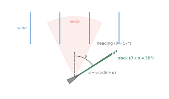
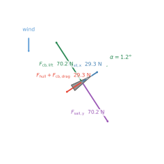
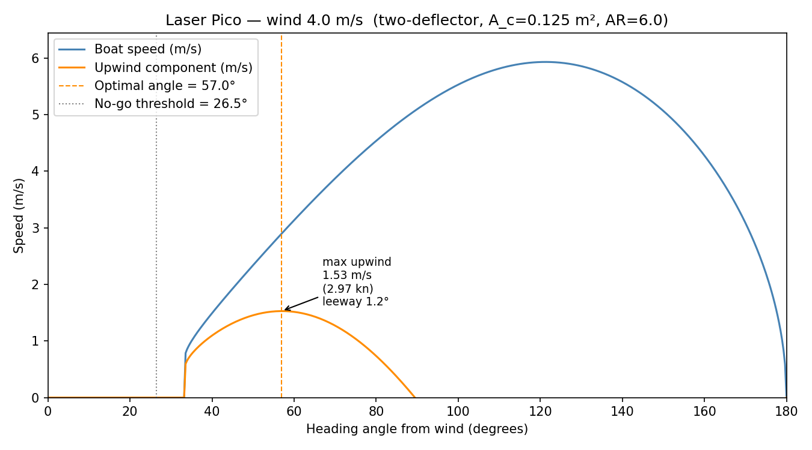
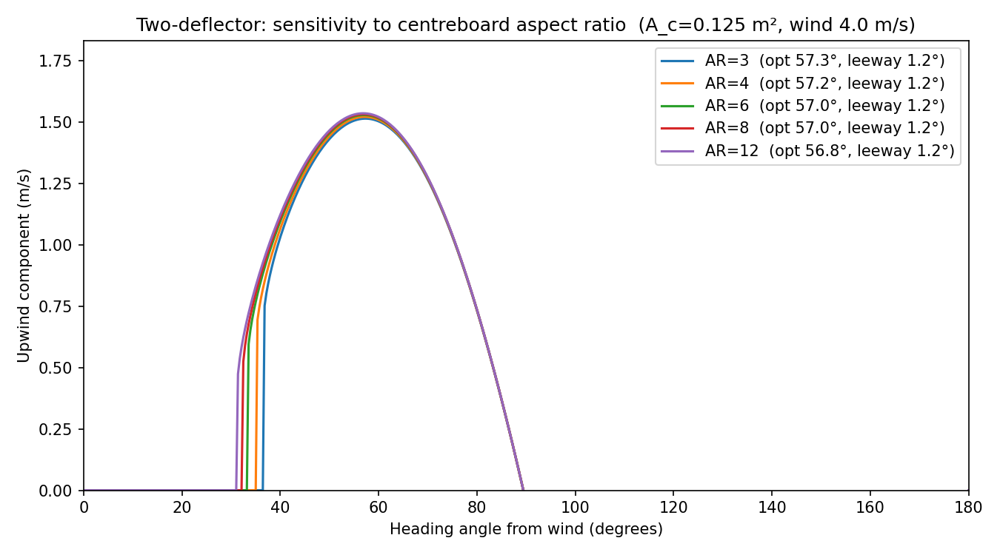

# Two-Deflector Model

The [base model](README.md) makes a sharp asymmetry: the sail is treated as a
momentum deflector acting on a column of air, while the centreboard is given
infinite lateral resistance — leeway is forbidden by assumption.
That is equivalent to giving the water-foil infinite area.

This note removes that assumption.
The centreboard is modelled as a finite **lifting surface** whose side-force
grows with leeway angle, introducing leeway $\alpha$ as a second equilibrium
variable alongside boat speed $v$.

---

## Coordinate frame

| symbol | meaning |
|--------|---------|
| $x'$ | along the boat's heading (positive = forward) |
| $y'$ | across the boat (positive = to leeward) |
| $\theta$ | heading angle from true wind |
| $\alpha$ | leeway angle (drift to leeward, $\alpha > 0$) |

The boat's actual track over water is $\theta + \alpha$ from the wind.

---

## Forces

The sail and hull drag follow the same momentum-flux framework as the
[base model](README.md#appendix-full-derivation), but now we track *both*
components of the sail force. The centreboard operates in a regime where
the momentum-flux model fails, so it is treated as a finite lifting surface
instead.

### Step 1 — Sail: how much air is intercepted?

The sail presents projected area $a_s|\sin\theta|$ to the wind (zero
head-to-wind, full area beam-reaching). In one second a column of air of
length $v_s$ sweeps past this cross-section, delivering mass flux:

$$\dot{m} = \rho_a \, a_s \, v_s \, |\sin\theta|$$

This is identical to the base model; the derivation is in
[Step 1 of the base-model appendix](README.md#step-1--how-much-air-does-the-sail-intercept).

### Step 2 — Sail: forward force ($x'$ component)

Define unit vectors in the boat's frame. The wind velocity in world
coordinates is $(0,-v_s)$. The forward unit vector is
$\hat{x}' = (\sin\theta,\cos\theta)$.

**Incoming:** the component of wind velocity along $\hat{x}'$:

$$v_\text{in,fwd} = (0,-v_s)\cdot(\sin\theta,\cos\theta) = -v_s\cos\theta$$

(negative: the wind opposes the heading for $\theta < 90°$).

**Outgoing:** the sail deflects the air to leave along $+\hat{x}'$ at speed
$D_s v_s$, so $v_\text{out,fwd} = +D_s v_s$.

Applying the no-go-zone constraint (see
[base model Step 2](README.md#step-2--force-from-the-sail-decomposing-momentum-change)
for the full argument), the net forward drive is:

$$\boxed{F_{\text{sail},x'} = \rho_a \, a_s \, v_s^2 \, |\sin\theta|(D_s - \cos\theta)}$$

Positive only for $\theta > \arccos D_s \approx 26.5°$.

### Step 3 — Sail: leeward force ($y'$ component)

The leeward unit vector in world coordinates is
$\hat{y}' = (\cos\theta,-\sin\theta)$ (90° clockwise from $\hat{x}'$).

**Incoming:** the component of wind velocity along $\hat{y}'$:

$$v_\text{in,lwd} = (0,-v_s)\cdot(\cos\theta,-\sin\theta) = +v_s\sin\theta$$

(positive: the beam component of the wind pushes the boat to leeward).

**Outgoing:** after the sail the air exits axially (along $\hat{x}'$), so it
carries zero leeward velocity: $v_\text{out,lwd} = 0$.

The air has shed leeward momentum $\dot{m}\,v_s\sin\theta$; by Newton's third
law the boat gains it:

$$\boxed{F_{\text{sail},y'} = \rho_a \, a_s \, v_s^2 \, \sin^2\!\theta \qquad \text{(leeward)}}$$

This is the term the base model discards by assuming infinite lateral
resistance.

### Step 4 — Why the momentum-flux model fails for the centreboard

**Applying the deflector formula directly.** We could attempt to treat the
centreboard as a deflector of the sideways water flow, exactly as the sail
deflects air. The water approaches the centreboard at leeway angle $\alpha$ to
the board's chord. Substituting $\alpha$ for $\theta$ and a centreboard
momentum-retention coefficient $D_c$ for $D_s$ in the sail formula gives:

$$F_\text{cb,windward}^\text{deflector} = \rho_w \, A_c \, v^2 \, |\sin\alpha|(D_c - \cos\alpha)$$

For this to be positive (a windward restoring force) we need $D_c > \cos\alpha$,
i.e.:

$$\alpha > \arccos(D_c)$$

A well-made centreboard has $D_c \approx 0.98$ (only 2 % of the water's
momentum absorbed by friction), giving $\arccos(0.98) \approx 11.5°$.

At realistic leeway angles of 1–3°, $\cos\alpha \approx 0.9998 > D_c$, so
$D_c - \cos\alpha < 0$: the formula predicts a **leeward** push — the
centreboard makes the drift *worse* rather than better. The momentum-flux model
does not merely underestimate the side-force; it gets the sign wrong at every
angle a real boat actually sails.

**Why the deflector model gets the physics wrong.** The sail acts as a deflector
because it genuinely redirects a column of air through a large angle (30°–70°):
the incoming air has a substantial component perpendicular to the exit direction,
and the momentum change is the dominant source of force. Pressure differences play
a secondary role.

A centreboard at 1–3° leeway is in a completely different regime. At $\alpha = 2°$
only $\sin 2° \approx 3.5\%$ of the water velocity is directed toward the board's
face; the remaining 99.4% flows *along* the chord. The board does not meaningfully
redirect this flow. Instead, the streamlined profile shifts the stagnation point
slightly, causing the flow to accelerate on the suction face and decelerate on the
pressure face. By the **Kutta–Joukowski theorem**, this pressure difference generates
a force *perpendicular to the flow* even though the flow is barely deflected at all.
The mechanism is circulation, not momentum redirection.

**Summary of the two regimes:**

| | Deflector (sail) | Lifting surface (centreboard) |
|---|---|---|
| Physical mechanism | momentum redirection | circulation / pressure difference |
| Side-force scales as | $\sin\theta\,(D - \cos\theta)$ | $\sin\alpha \approx \alpha$ |
| No-force zone | $\theta < \arccos D_s \approx 26°$ | none for $\alpha > 0$ |
| Reliable range | large angles (30°–70°) | small angles ($\lesssim 10°$) |

Thin aerofoil theory captures the circulation mechanism analytically and is valid
when:

- The foil is thin relative to its chord ($t/c \lesssim 0.12$ for a dinghy board).
- The angle of attack is well below stall ($\alpha \lesssim 10°$; typical leeway
  is 1–3°).
- The flow is approximately inviscid away from the boundary layer: at $v = 2$ m/s
  and chord $c \approx 0.3$ m the chord Reynolds number is $Re \approx 6\times10^5$,
  well into the turbulent-attached regime where potential-flow theory is accurate.

### Step 5 — Centreboard lift

Due to leeway $\alpha$ the water approaches the centreboard at angle of attack
$\alpha$ to its chord line. The dynamic pressure is $q = \tfrac{1}{2}\rho_w v^2$.

Thin aerofoil theory for an infinite (2D) flat plate gives (Glauert 1926;
Anderson 2017 §4.7):

$$C_L = 2\pi\sin\alpha \approx 2\pi\alpha$$

The approximation holds well for $\alpha < 5°$. The resulting windward
restoring force is:

$$\boxed{F_{\text{cb},y'} = q\,A_c\,C_L = \pi\rho_w A_c \sin\alpha \cdot v^2 \qquad \text{(windward)}}$$

**Dimensional check:**  
$[\pi\rho_w A_c \sin\alpha \cdot v^2]
= \text{(kg\,m}^{-3}\text{)(m}^2\text{)(m}^2\text{s}^{-2}\text{)}
= \text{N}$

### Step 6 — Centreboard induced drag

A centreboard has finite span $b$ and aspect ratio $\mathrm{AR} = b^2/A_c$
(typically $\approx 6$). Prandtl's lifting-line theory (Prandtl 1918; Anderson
2017 §5.3) shows that any finite wing generating lift must also generate
*induced drag* — a drag penalty caused by trailing vortices that tilt the
local lift vector aft. For an elliptical lift distribution (Oswald efficiency
$e = 1$, a good approximation for a tapered board):

$$C_{D,i} = \frac{C_L^2}{\pi \cdot \mathrm{AR}}$$

Substituting $C_L = 2\pi\sin\alpha$:

$$C_{D,i} = \frac{(2\pi\sin\alpha)^2}{\pi \cdot \mathrm{AR}} = \frac{4\pi\sin^2\!\alpha}{\mathrm{AR}}$$

This induced drag opposes forward motion ($-x'$ direction):

$$\boxed{F_{\text{cb},x'} = -q\,A_c\,C_{D,i} = -\frac{2\pi\rho_w A_c \sin^2\!\alpha}{\mathrm{AR}}\,v^2}$$

For $\mathrm{AR} = 6$ and $\alpha = 2°$ at $v = 2.5$ m/s this is roughly
$0.05$ N — a small but real drag penalty that reduces upwind speed slightly
below the one-deflector prediction.

### Step 7 — Hull drag

Unchanged from the base model
(see [base model Step 3](README.md#step-3--hull-drag)):

$$F_{\text{hull}} = -(1-D_h)\,\rho_w\,A_h\,v^2$$

---

## Equilibrium

Setting net forward and leeward forces to zero simultaneously gives two
equations in the unknowns $(v, \alpha)$ for each heading $\theta$.

**Forward balance** (Steps 2, 6, 7):

$$\underbrace{\rho_a a_s v_s^2 \sin\theta(D_s-\cos\theta)}_{\text{sail drive}} = \underbrace{\frac{2\pi\rho_w A_c \sin^2\!\alpha}{\mathrm{AR}}\,v^2}_{\text{CB induced drag}} + \underbrace{(1-D_h)\rho_w A_h v^2}_{\text{hull drag}} \tag{1}$$

**Leeward balance** (Steps 3, 5):

$$\underbrace{\rho_a a_s v_s^2 \sin^2\!\theta}_{\text{sail side-force}} = \underbrace{\pi \rho_w A_c \sin\alpha \cdot v^2}_{\text{CB lift}} \tag{2}$$

(Hull side-drag is small compared with centreboard side-force and is ignored.)

**Eliminating $v^2$.** Solve equation (2) for $v^2$:

$$v^2 = \frac{\rho_a a_s v_s^2 \sin^2\!\theta}{\pi\rho_w A_c \sin\alpha} \tag{$2'$}$$

Substitute into equation (1) and divide through by $\rho_a a_s v_s^2$:

$$\pi A_c (D_s - \cos\theta)\sin\alpha = \sin\theta\!\left[\frac{2\pi A_c \sin^2\!\alpha}{\mathrm{AR}} + (1-D_h)A_h\right] \tag{3}$$

This single transcendental equation in $\alpha$ can be solved for any $\theta$.

**Small-leeway approximation.** For $\alpha \ll 1$ the quadratic term
$\sin^2\!\alpha \approx 0$ and equation (3) linearises to:

$$\alpha \approx \frac{(1-D_h)\,A_h\,\sin\theta}{\pi A_c (D_s - \cos\theta)} \tag{4}$$

For the Laser Pico at $\theta = 57°$:

$$\alpha \approx \frac{0.1\times0.0343\times\sin 57°}{\pi\times0.125\times(0.895-\cos 57°)} \approx 1.2°$$

matching the full numerical result — confirming that induced drag is negligible
at these small leeway angles, and that a larger centreboard area $A_c$ directly
reduces leeway (equation 4 shows $\alpha \propto 1/A_c$).

Once $\alpha$ is found from equation (3), $v$ follows from equation ($2'$).

**Limiting case: infinite centreboard.** As $A_c \to \infty$, equation (2)
forces $\sin\alpha \to 0$ and the induced-drag term in equation (1) vanishes,
recovering the one-deflector speed formula exactly.

---

## Results for the Laser Pico

  

*Left: heading $\theta$ (grey) vs actual track $\theta+\alpha$ (green) at the optimal
angle. Right: full force breakdown — sail drive and leeward push (blue/purple),
centreboard lift balancing the leeward push (green), combined drag opposing
forward motion (red).*



*Boat speed and upwind component vs heading. The annotation shows the maximum
upwind speed, the corresponding optimal heading, and the leeway angle at that point.*



*Upwind component vs heading for centreboard aspect ratios AR ∈ {3, 4, 6, 8, 12}
(centreboard area $A_c = 0.125$ m² fixed). Higher AR → less induced drag → slightly
higher upwind speed and marginally narrower optimal heading.*

Centreboard: $A_c = 0.125\ \text{m}^2$, $\mathrm{AR} = 6$.

| $\theta$ (°) | $v$ (m/s) | $\alpha$ (°) | $u = v\cos(\theta+\alpha)$ (m/s) |
|:---:|:---:|:---:|:---:|
| 33 | 0.76 | 7.7 | 0.57 |
| 45 | 1.92 | 2.0 | 1.31 |
| 56 | 2.85 | 1.2 | 1.53 |
| 62 | 3.29 | 1.0 | 1.49 |
| 73 | 4.12 | 0.8 | 1.11 |

**Optimal heading: $\theta_\text{opt} = 57.0°$, leeway $\alpha = 1.2°$,
effective track $58.2°$ from wind.**

True upwind speed: **1.53 m/s** (2.97 knots).

Compared with the one-deflector model ($\theta_\text{opt} = 56.8°$,
$u_\text{max} = 1.59$ m/s), the optimal heading is virtually unchanged — confirming that the base model's closed-form cubic gives the right answer to good
accuracy. The upwind speed is slightly *lower* because centreboard induced drag
adds a small forward-resistance penalty.

### Sensitivity to centreboard size

| $A_c$ (m²) | $\theta_\text{opt}$ (°) | Leeway (°) | $u_\text{max}$ (m/s) |
|:---:|:---:|:---:|:---:|
| 0.05 | 57.3 | 3.1 | 1.43 |
| 0.10 | 57.1 | 1.5 | 1.51 |
| 0.125 | 57.0 | 1.2 | 1.53 |
| 0.20 | 57.0 | 0.8 | 1.55 |
| 0.30 | 57.0 | 0.5 | 1.57 |
| 1.00 | 56.8 | 0.2 | 1.59 |

As $A_c \to \infty$ the leeway $\to 0$ and the result converges to the
one-deflector model, as expected.
Smaller centreboard → more leeway → more induced drag → lower upwind speed and
a very slightly wider optimal heading, consistent with the intuition that a
boat with a poor centreboard should bear away slightly.

---

## What the model still cannot do

* The sail side-force ($F_{\text{sail},y'}$) in this derivation assumes air
  exits *axially* — a rough approximation that over-states the leeward push
  at very large $\theta$. A full 2-D deflector would require tracking the
  exit direction of the air.
* Hull side-drag (the water resistance opposing leeway from the hull itself,
  not just the centreboard) is ignored.
* Heel angle and its effect on effective sail area and underwater body are
  ignored.
* The thin-plate $C_L = 2\pi\alpha$ formula holds only for small $\alpha$ and
  attached flow — reasonable for $\alpha < 5°$ but the model should not be
  trusted at larger leeway.

---

## Code

The model lives in
[`sailing_upwind/two_deflector.py`](sailing_upwind/two_deflector.py).

To run the full model and regenerate all plots and diagrams, use the CLI
(config is managed by [Hydra](https://hydra.cc) — any config key can be
overridden on the command line):

```bash
# Default Laser Pico parameters
python -m sailing_upwind

# Try a stronger wind
python -m sailing_upwind wind.speed_ms=7

# Larger centreboard with higher aspect ratio
python -m sailing_upwind model.centreboard.area_m2=0.20 model.centreboard.aspect_ratio=8
```

To use the two-deflector model for the main upwind-speed plot:

```bash
python -m sailing_upwind model.mode=two_deflector
```

Or call the Python API directly:

```python
from sailing_upwind.two_deflector import TwoDeflectorParams, optimal_angle

p = TwoDeflectorParams(
    v_s=4.0,      # wind speed m/s
    a_s=5.1,      # sail area m^2
    rho_a=1.225,
    D_s=0.895,    # sail drag coefficient
    A_c=0.125,    # centreboard area m^2
    AR_c=6.0,     # centreboard aspect ratio
    D_h=0.9,      # hull drag coefficient
    rho_w=1000.0,
    A_h=0.0343,   # hull frontal area m^2
)

theta_opt, v_opt, alpha_opt = optimal_angle(p)
```

---

## References

- Glauert, H. (1926). *The Elements of Aerofoil and Airscrew Theory*.
  Cambridge University Press.
  *(Classic derivation of $C_L = 2\pi\alpha$ for a thin flat plate using
  potential flow theory; the essential reference for Step 5 above.)*

- Prandtl, L. (1918). Tragflügeltheorie I & II. *Nachrichten von der
  Gesellschaft der Wissenschaften zu Göttingen, Mathematisch-Physikalische
  Klasse*, 451–477 and 107–137.
  *(Original lifting-line theory giving $C_{D,i} = C_L^2/(\pi\,\mathrm{AR})$;
  available in English translation as NACA Technical Report No. 116, 1921.)*

- Anderson, J. D. (2017). *Fundamentals of Aerodynamics* (6th ed.).
  McGraw-Hill. §§4.7, 5.3.
  *(Accessible textbook treatment of thin aerofoil theory and Prandtl's
  lifting-line theory with worked examples.)*

- Wolfe, J. (2002). The physics of sailing.
  University of New South Wales.
  [Link](https://newt.phys.unsw.edu.au/~jw/sailing.html)
  *(Momentum-flux treatment of the sail force that underpins both models.)*
